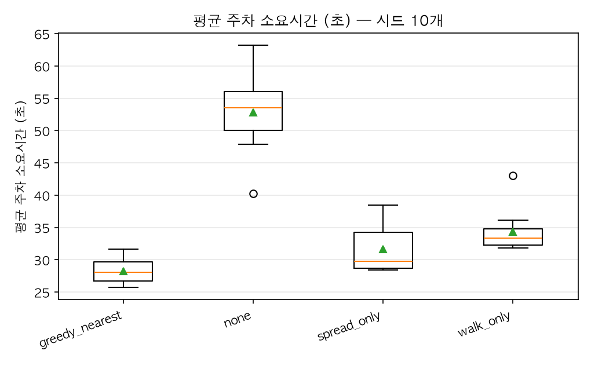
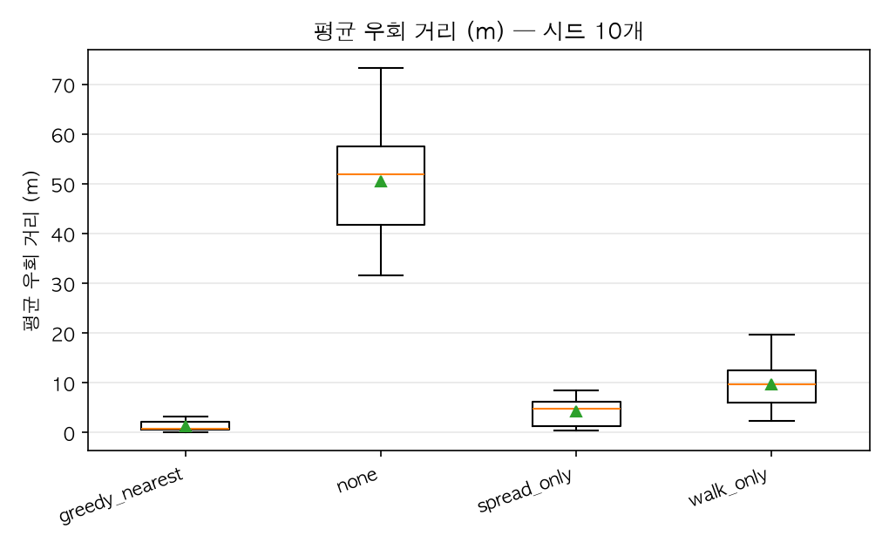
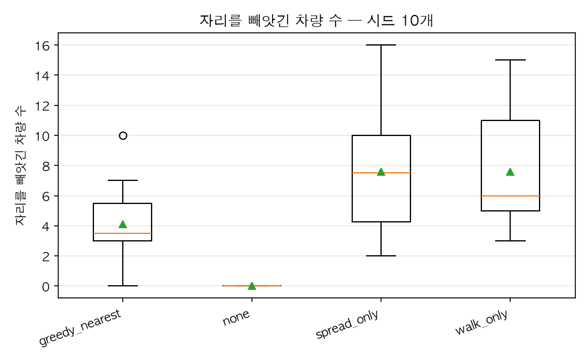

# busy — 전략 비교

주말 오후. 절반쯤 차 있는 상태에서 시작해 점유율 60~70% 를 오간다. 좋은 자리는 이미 임자가 있고 빈 자리는 안쪽에 남아 있어, 안내와 운전자의 선호가 어긋나기 시작한다.

| 전략 | 평균 주차소요(초) | p95 주차소요(초) | 평균 우회(m) | p95 우회(m) | 주차 완료(대) | 피해 차량(대) | 재배정 | 휘말린 재배치 | 강제 합류 |
|---|---|---|---|---|---|---|---|---|---|
| greedy_nearest | 28.2 ± 2.0 | 46.7 ± 13.6 | 1.3 ± 1.1 | 2.6 ± 3.2 | 179.7 ± 11.4 | 4.1 ± 2.9 | 4.3 ± 3.0 | 41.5 ± 27.9 | 93.6 ± 39.5 |
| none | 52.9 ± 6.2 | 112.8 ± 21.0 | 50.6 ± 13.4 | 230.2 ± 70.8 | 118.0 ± 8.3 | 0.0 | 0.0 | 0.0 | 142.8 ± 38.2 |
| spread_only | 31.7 ± 3.7 | 63.1 ± 25.6 | 4.3 ± 2.9 | 25.6 ± 22.3 | 177.2 ± 9.7 | 7.6 ± 4.5 | 8.3 ± 5.1 | 81.3 ± 59.9 | 115.9 ± 34.4 |
| walk_only | 34.4 ± 3.4 | 61.1 ± 21.5 | 9.7 ± 5.2 | 61.3 ± 44.0 | 174.0 ± 8.5 | 7.6 ± 4.3 | 7.9 ± 4.7 | 92.0 ± 58.8 | 57.0 ± 20.8 |

시드 10개 × 900초. 값은 **평균 ± 표준편차**이며, 편차가 적힌 것은 시드마다 결과가 다르다는 뜻이다.

### 무안내 대비

| 지표 | 무안내 | 안내 | 차이 |
|---|---|---|---|
| 평균 주차소요(초) (낮을수록 좋다) | 52.9 | 28.2 | **-47%** |
| p95 주차소요(초) (낮을수록 좋다) | 112.8 | 46.7 | **-59%** |
| 평균 우회(m) (낮을수록 좋다) | 50.6 | 1.3 | **-97%** |
| p95 우회(m) (낮을수록 좋다) | 230.2 | 2.6 | **-99%** |
| 주차 완료(대) (높을수록 좋다) | 118.0 | 179.7 | **+52%** |
| 피해 차량(대) | 해당 없음 | 4.1 | — |
| 재배정 | 해당 없음 | 4.3 | — |
| 휘말린 재배치 | 해당 없음 | 41.5 | — |
| 강제 합류 (낮을수록 좋다) | 142.8 | 93.6 | **-34%** |

'해당 없음' 은 무안내 모드에 **예약이 없어** 그 사건이 정의되지 않는다는 뜻이다. 빼앗길 자리가 없으므로 강탈도 재배정도 0 이 아니라 성립하지 않는다.

### 분포

