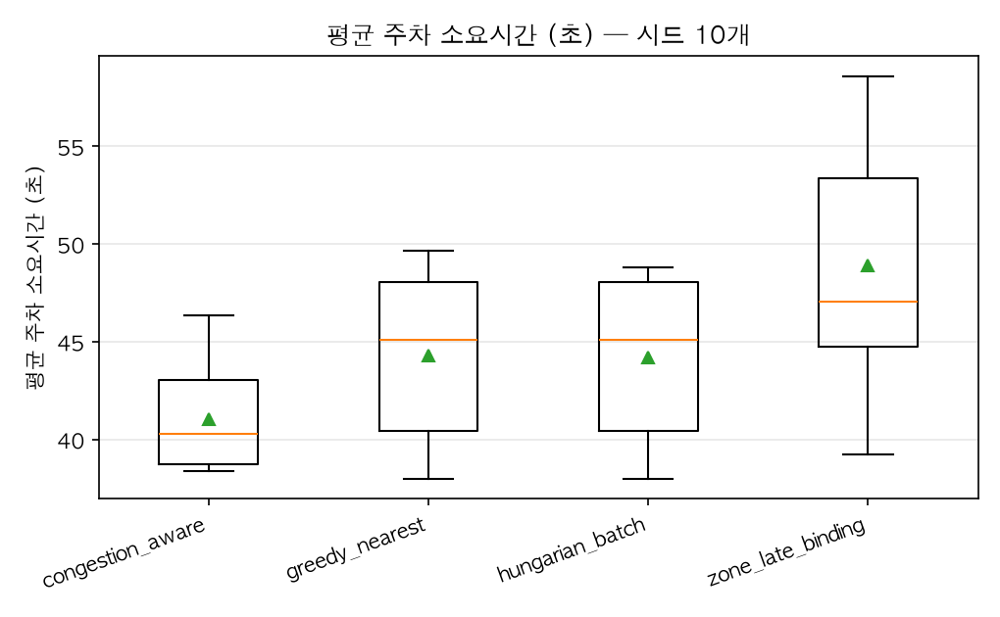
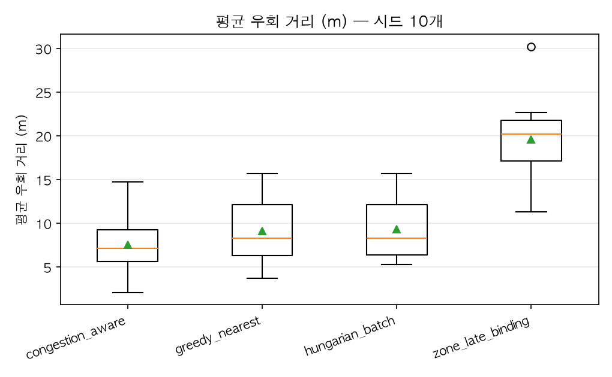
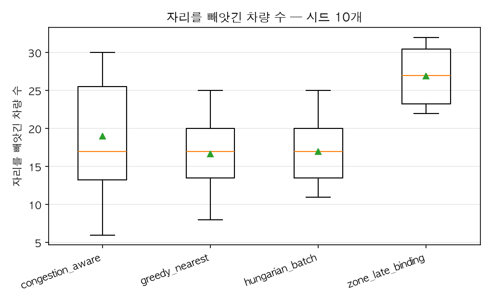

# rush_hour — 전략 비교

**이 연구가 답하려는 상황.** 점유율이 90% 를 넘고 좋은 자리는 남지 않는다. 관제가 안쪽 자리를 배정하는 순간 비협조 운전자는 눈앞의 앞자리를 차지하고, 그 자리의 원래 주인은 갈 곳을 잃는다. 복구 전략의 차이가 여기서 드러난다.
전원 협조(noncompliant_share: 0.0)로 한 번 더 돌려 대조군을 만드세요. 같은 혼잡도에서 강탈이 0 건이면 측정에 바닥 노이즈가 없다는 뜻입니다.

| 전략 | 평균 주차소요(초) | p95 주차소요(초) | 평균 우회(m) | p95 우회(m) | 주차 완료(대) | 피해 차량(대) | 재배정 | 휘말린 재배치 | 강제 합류 |
|---|---|---|---|---|---|---|---|---|---|
| congestion_aware | 41.1 ± 2.7 | 78.2 ± 8.7 | 7.5 ± 3.5 | 57.1 ± 28.2 | 129.6 ± 8.1 | 19.0 ± 8.1 | 21.9 ± 9.8 | 237.1 ± 120.4 | 260.3 ± 35.6 |
| greedy_nearest | 44.3 ± 4.5 | 97.5 ± 18.9 | 9.1 ± 3.8 | 61.3 ± 28.0 | 121.4 ± 6.5 | 16.7 ± 5.1 | 18.6 ± 5.3 | 214.1 ± 116.7 | 245.0 ± 41.1 |
| hungarian_batch | 44.2 ± 4.4 | 97.5 ± 18.9 | 9.4 ± 3.5 | 61.9 ± 27.5 | 121.6 ± 6.7 | 17.0 ± 4.6 | 18.9 ± 4.7 | 216.1 ± 114.5 | 248.8 ± 42.8 |
| zone_late_binding | 48.9 ± 6.6 | 116.4 ± 38.1 | 19.6 ± 5.3 | 122.7 ± 29.2 | 122.8 ± 3.5 | 26.9 ± 3.8 | 31.5 ± 4.4 | 337.3 ± 94.7 | 215.8 ± 33.7 |

시드 10개 × 900초. 값은 **평균 ± 표준편차**이며, 편차가 적힌 것은 시드마다 결과가 다르다는 뜻이다.

### 분포

