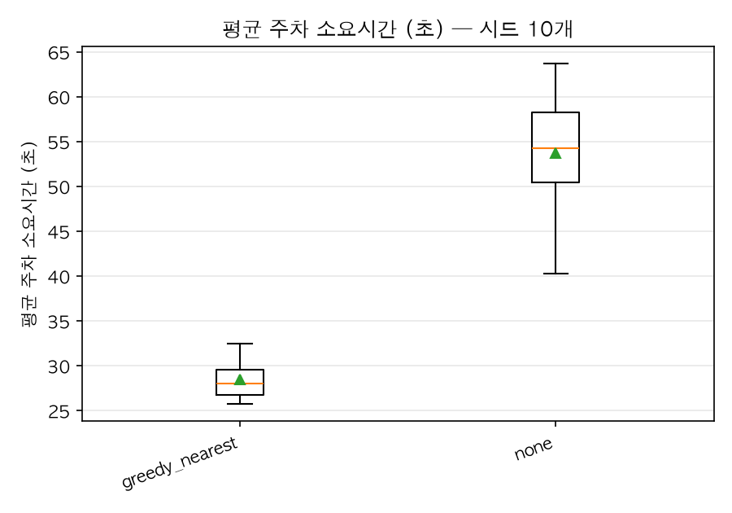
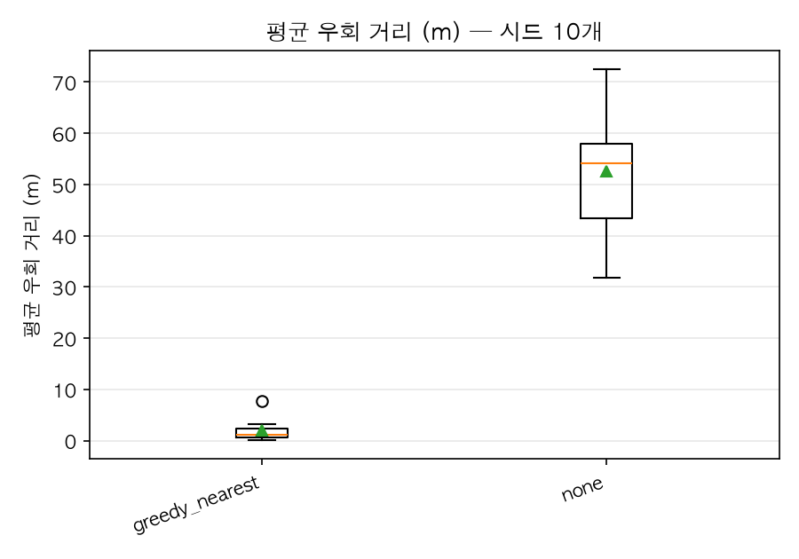
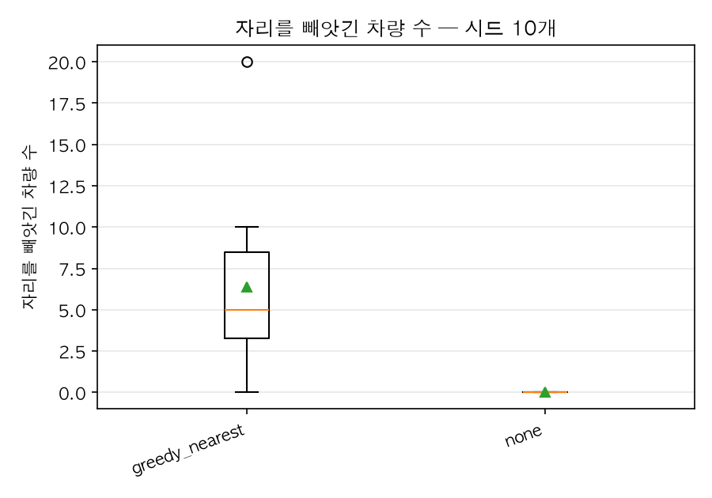

# busy — 전략 비교

주말 오후. 절반쯤 차 있는 상태에서 시작해 점유율 60~70% 를 오간다. 좋은 자리는 이미 임자가 있고 빈 자리는 안쪽에 남아 있어, 안내와 운전자의 선호가 어긋나기 시작한다.

| 전략 | 평균 주차소요(초) | p95 주차소요(초) | 평균 우회(m) | p95 우회(m) | 주차 완료(대) | 피해 차량(대) | 재배정 | 휘말린 재배치 | 강제 합류 |
|---|---|---|---|---|---|---|---|---|---|
| greedy_nearest | 28.4 ± 2.3 | 47.9 ± 13.3 | 2.0 ± 2.2 | 8.4 ± 16.8 | 179.0 ± 9.1 | 6.4 ± 5.8 | 6.8 ± 6.3 | 93.7 ± 121.8 | 98.8 ± 47.4 |
| none | 53.7 ± 6.7 | 115.7 ± 26.5 | 52.6 ± 13.6 | 241.3 ± 78.7 | 118.2 ± 8.4 | 0.0 | 0.0 | 0.0 | 142.8 ± 38.7 |

시드 10개 × 900초. 값은 **평균 ± 표준편차**이며, 편차가 적힌 것은 시드마다 결과가 다르다는 뜻이다.

### 무안내 대비

| 지표 | 무안내 | 안내 | 차이 |
|---|---|---|---|
| 평균 주차소요(초) (낮을수록 좋다) | 53.7 | 28.4 | **-47%** |
| p95 주차소요(초) (낮을수록 좋다) | 115.7 | 47.9 | **-59%** |
| 평균 우회(m) (낮을수록 좋다) | 52.6 | 2.0 | **-96%** |
| p95 우회(m) (낮을수록 좋다) | 241.3 | 8.4 | **-97%** |
| 주차 완료(대) (높을수록 좋다) | 118.2 | 179.0 | **+51%** |
| 피해 차량(대) | 해당 없음 | 6.4 | — |
| 재배정 | 해당 없음 | 6.8 | — |
| 휘말린 재배치 | 해당 없음 | 93.7 | — |
| 강제 합류 (낮을수록 좋다) | 142.8 | 98.8 | **-31%** |

'해당 없음' 은 무안내 모드에 **예약이 없어** 그 사건이 정의되지 않는다는 뜻이다. 빼앗길 자리가 없으므로 강탈도 재배정도 0 이 아니라 성립하지 않는다.

### 분포

