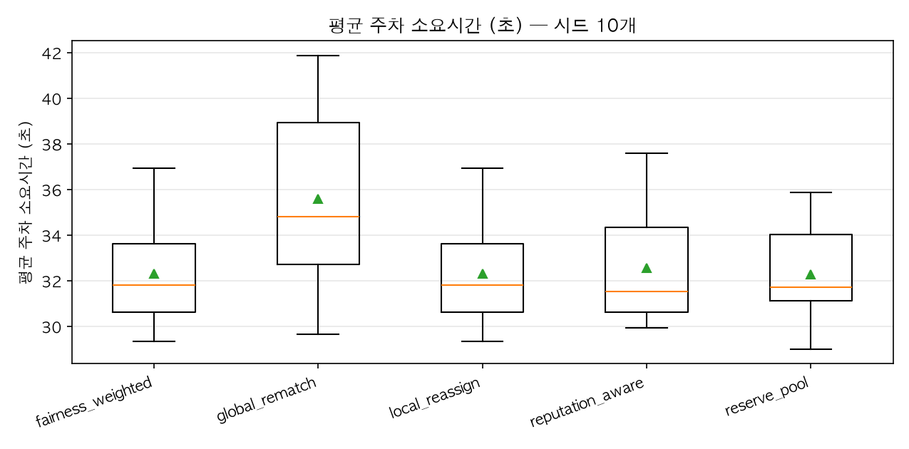
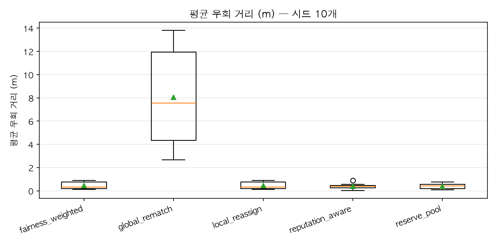
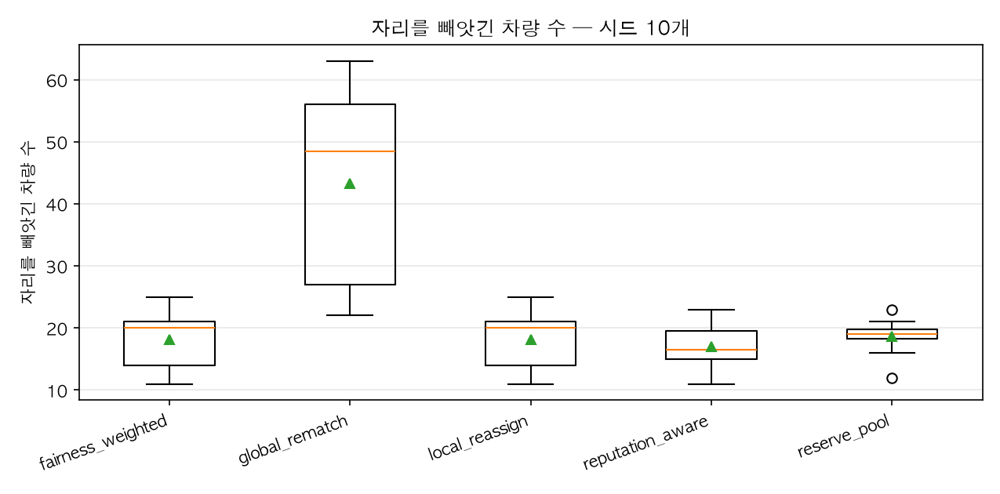

# repeat_offenders — 전략 비교

**평판이 의미를 갖는 조건.** `rush_hour` 에서 복구 전략 6종을 비교했더니 `local_reassign` · `fairness_weighted` · `reputation_aware` 셋이 **글자 그대로 같은 숫자**를 냈습니다. 버그가 아니라 조건 때문입니다 — 재 봤더니 신뢰도가 떨어진 번호판이 220개 중 7개뿐이고, 두 번 재배정된 차량은 **0대**였습니다. 평판을 쌓을 재료도, 우선권을 줄 상습 피해자도 없었습니다.
그래서 같은 번호판이 여러 번 드나드는 조건을 따로 만듭니다. 체류를 짧게, 재방문을 높게, 실행을 길게 잡아 한 번호판이 하루에 대여섯 번 오게 합니다. 이 조건에서도 셋이 같다면 그때는 전략 설계를 의심해야 합니다.
발표에서는 `rush_hour` 와 나란히 놓으세요. "평판 기반 전략은 평판이 쌓일 만큼 같은 사람이 반복해서 올 때만 의미가 있다"가 결론입니다.

| 전략 | 평균 주차소요(초) | p95 주차소요(초) | 평균 우회(m) | p95 우회(m) | 주차 완료(대) | 피해 차량(대) | 재배정 | 휘말린 재배치 | 강제 합류 |
|---|---|---|---|---|---|---|---|---|---|
| fairness_weighted | 32.3 ± 2.3 | 73.3 ± 19.7 | 0.5 ± 0.3 | 1.5 ± 0.2 | 427.1 ± 16.8 | 18.2 ± 4.8 | 19.5 ± 5.4 | 0.0 | 273.7 ± 70.6 |
| global_rematch | 35.6 ± 4.2 | 85.5 ± 23.9 | 8.0 ± 4.2 | 67.6 ± 32.1 | 425.1 ± 22.0 | 43.3 ± 15.5 | 57.6 ± 22.9 | 1121.4 ± 547.9 | 312.7 ± 99.7 |
| local_reassign | 32.3 ± 2.3 | 73.3 ± 19.7 | 0.5 ± 0.3 | 1.5 ± 0.2 | 427.1 ± 16.8 | 18.2 ± 4.8 | 19.5 ± 5.4 | 0.0 | 273.7 ± 70.6 |
| reputation_aware | 32.6 ± 2.6 | 73.7 ± 20.8 | 0.4 ± 0.2 | 1.4 ± 0.3 | 426.0 ± 16.2 | 17.0 ± 3.6 | 18.0 ± 4.1 | 0.0 | 281.8 ± 68.4 |
| reserve_pool | 32.3 ± 2.4 | 69.0 ± 16.9 | 0.4 ± 0.2 | 1.7 ± 0.2 | 430.9 ± 14.4 | 18.6 ± 3.0 | 19.3 ± 3.3 | 0.0 | 291.9 ± 63.4 |

시드 10개 × 1800초. 값은 **평균 ± 표준편차**이며, 편차가 적힌 것은 시드마다 결과가 다르다는 뜻이다.

### 분포

